# 上机作业 A1：初试环境和工具

学号：10234500007  
姓名：丁熙妍

## 系统信息

- 操作系统：Ubuntu 24.04 LTS，运行在 Windows 宿主机的 WSL2 中。
- CPU：WSL2 中显示 AMD Ryzen 9 8940HX with Radeon Graphics，12 个 Core、每 Core 2 个硬件线程，共 24 个逻辑 CPU。
- 内存：当前 WSL2 可见内存约 9.7 GiB。

## 1. 环境搭建和工具安装

| 项目 | 本机版本 | 课程要求 |
| --- | --- | --- |
| Ubuntu / Kernel | Ubuntu 24.04 LTS / Linux 6.6 | Ubuntu 20.04 LTS / 5.4+ |
| GCC / Clang | 13.3 / 18.1 | 9.3+ / 10.0+ |
| Python / Java | 3.12 / OpenJDK 21.0 | 3.8+ / 11+ |
| Valgrind / perf | 3.22 / 6.6 | 3.17+ / 5.4+ |
| OpenCilk | 已安装；所附 OpenCilk 编译器为 Clang 19.1，`-fopencilk` 编译检查通过 | 1.0+ |

## 2. 常用工具命令操作练习

### (1) `uname -a`

**a.** 输出依次包含内核名称、主机名、内核发行号、构建信息、架构和操作系统名称。本次输出为 `Linux ddd 6.6.87.2-microsoft-standard-WSL2 #1 SMP PREEMPT_DYNAMIC Thu Jun 5 18:30:46 UTC 2025 x86_64 x86_64 x86_64 GNU/Linux`。

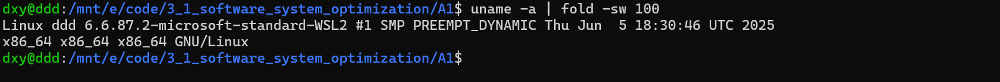

**b.** Linux 内核发行号为 `6.6.87.2-microsoft-standard-WSL2`；指令集架构为 `x86_64`。

### (2) `cat /etc/os-release`

**a.** 本机发行版名称 `NAME=Ubuntu`，完整名称 `PRETTY_NAME=Ubuntu 24.04.5 LTS`，版本标识 `VERSION_ID=24.04`，完整版本 `VERSION=24.04.5 LTS (Noble Numbat)`，代号 `VERSION_CODENAME=noble`。`ID=ubuntu` 是发行版标识，`ID_LIKE=debian` 表示其所属发行版家族；文件还给出支持、报错等网址。

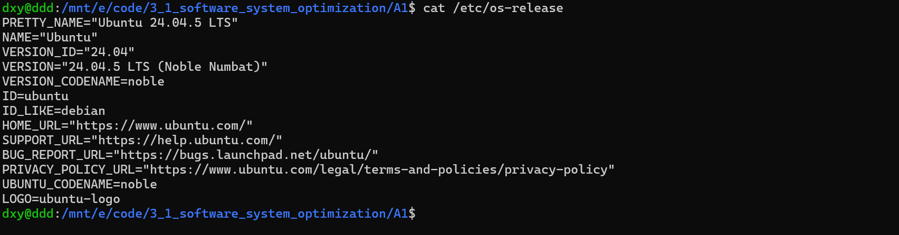

### (3) `sysctl -a`

**a.** `sysctl` 读取或设置内核运行参数；`-a` 列出当前可见的全部参数及其值。

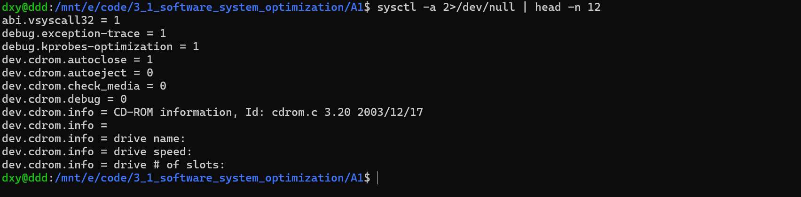

**b.** 大量 `sysctl` 键映射到 `/proc/sys` 中的文件，例如 `kernel.ostype` 对应 `/proc/sys/kernel/ostype`。点分隔键名对应目录层级。

**c.** `kernel.ostype = Linux`、`kernel.osrelease = 6.6.87.2-microsoft-standard-WSL2`，与 `uname -a` 中的内核名称和发行号一致。`/etc/os-release` 显示的 Ubuntu 24.04.5 是发行版版本。

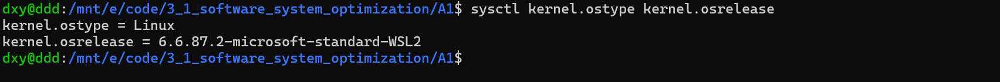

**d.** `kernel.perf_event_max_sample_rate = 100000` 限制 perf 采样事件的最大采样频率；`kernel.sched_rr_timeslice_ms = 100` 规定 SCHED_RR 实时调度策略的轮转时间片，单位毫秒。

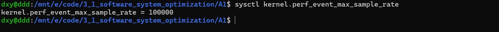

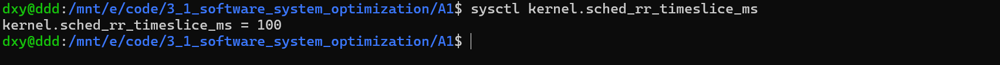

### (4) `lscpu`

**a.** 型号为 AMD Ryzen 9 8940HX with Radeon Graphics。WSL2 中显示 `Socket(s)=1`、`Core(s) per socket=12`、`Thread(s) per core=2`，对应 12 个 Core、24 个逻辑 CPU，每核两个硬件线程。基准、最大和最小频率在 `lscpu` 输出中均未显示。缓存为 L1d 384 KiB（12 个实例，每核 32 KiB）、L1i 384 KiB（12 个实例，每核 32 KiB）、L2 12 MiB（12 个实例，每核 1 MiB）、L3 32 MiB（1 个实例）；前三项显示的是各实例容量之和。

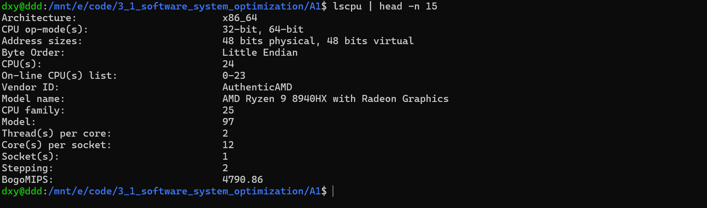

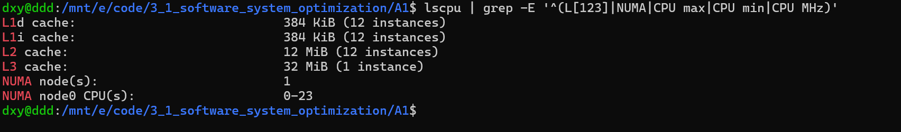

**b.** `Byte Order: Little Endian`，本机为小端序。网络协议通常使用大端的网络字节序，这是大端序的应用场景。

**c.** `Address sizes` 中的 physical 和 virtual 分别是物理地址与虚拟地址宽度。本机两者均为 48 位；64 位架构的地址宽度取决于处理器实现及虚拟化环境。

### (5) `dmidecode`

**a.** `dmidecode` 读取 SMBIOS/DMI 固件表中的硬件配置。

**b.** 在直接暴露相应信息的机器上，内存条条目通常可给出插槽、容量、类型、速率、制造商、序列号等。本机普通用户执行提示不能读取 `/dev/mem`；以 root 再次执行得到 `No SMBIOS nor DMI entry point found`。当前 WSL2 未提供内存条 DMI 信息。

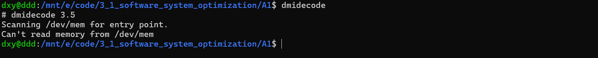

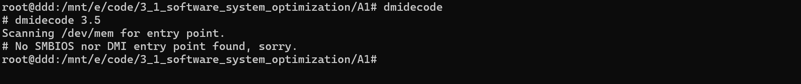


### (6) `numactl -H` 与 `numactl --show`

**a.** `numactl` 查看或设置进程的 NUMA 绑定和内存策略；`-H`（hardware）列出当前可见的 NUMA 硬件拓扑。

**b.** `numactl -H` 显示 `available: 1 nodes (0)`，节点 0 有逻辑 CPU 0–23；采样时节点内存约 9942 MB。

**c.** `node distances` 表示节点间访存成本的相对值，通常本地节点值较小。本机只有节点 0，到自身的距离为 10；在多节点机器上，数据库和并行计算的跨节点访存可能受距离影响。

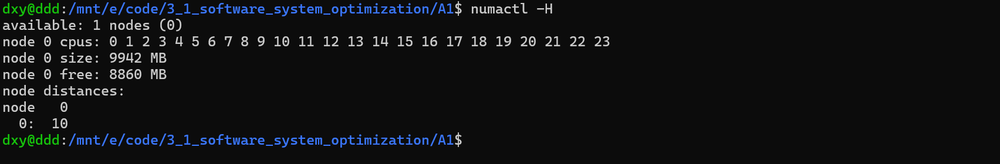

**d.** `numactl --show` 显示当前进程的 NUMA 策略和绑定：`policy: default`、`preferred node: current`、`physcpubind: 0 ... 23`、`cpubind: 0`、`nodebind: 0`、`membind: 0`。进程可用的逻辑 CPU 为 0–23，CPU 和内存节点均为 0。`-H` 显示系统节点及距离，`--show` 显示进程当前的策略和绑定。

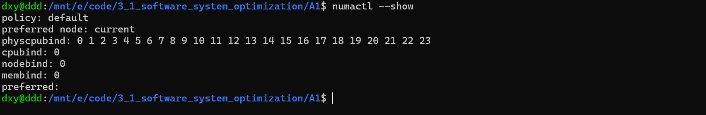

### (7) `free -h`

**a.** `Mem` 行给出内存总量、已用、空闲、共享、缓存和可用量。本次样本为总量 9.7 GiB、已用 639 MiB、空闲 8.7 GiB、`buff/cache` 600 MiB、`available` 9.1 GiB；`available` 是估计可供新程序使用的内存。`Swap` 行为总量 8.0 GiB、已用 0 B、空闲 8.0 GiB。

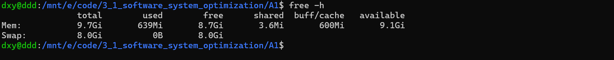

**b.** `GiB = 2^30` 字节，`GB = 10^9` 字节；二者数值基准不同。

### (8) `ps -aux`

**a.** 表头有 `USER`（用户）、`PID`（进程号）、`%CPU`（进程 CPU 百分比）、`%MEM`（进程驻留内存相对物理内存的比例）、`VSZ`（虚拟地址空间大小，KiB）、`RSS`（驻留物理内存，KiB）、`TTY`（关联终端，`?` 表示无终端）、`STAT`（状态及附加标记）、`START`（启动时间）、`TIME`（累计 CPU 时间）、`COMMAND`（启动命令）。样本中的 PID 1 是 `/sbin/init`。`ps` 显示的是执行时的进程快照。

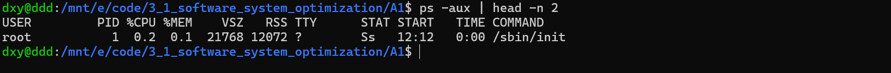

### (9) `top` 与 `htop`

**a.** `top` 首行显示当前时间、运行时长、登录用户数和最近 1、5、15 分钟 load average；`Tasks` 显示进程总数及运行、休眠、停止、僵尸数。`%Cpu(s)` 中 `us` 是用户态、`sy` 是内核态、`ni` 是调整过 nice 值的用户态进程占用、`id` 是空闲、`wa` 是 I/O 等待，`hi/si` 是硬/软中断，`st` 是虚拟机被宿主机占用的时间。`MiB Mem`、`MiB Swap` 分别显示内存和交换空间的总量、空闲及使用情况。进程表中的 PID、USER、PR、NI、VIRT、RES、SHR、S、`%CPU`、`%MEM`、`TIME+`、COMMAND 分别对应进程标识、用户、优先级、nice 值、虚拟/驻留/共享内存、状态、CPU/内存占比、累计 CPU 时间和命令。

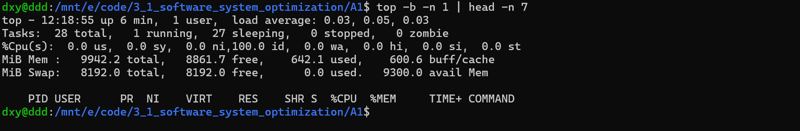

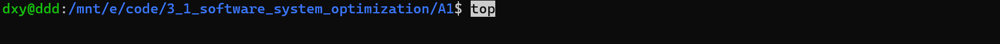

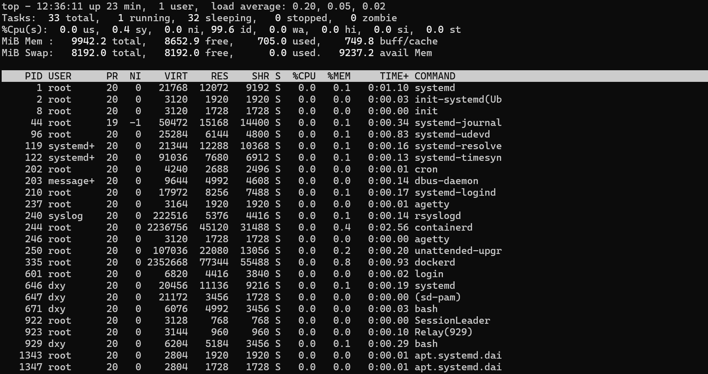

**b.** 两者都实时刷新。`htop` 显示各逻辑 CPU 的条形图，并提供搜索、排序、树形视图和功能键操作；`top` 以文字汇总和进程表为主，也支持交互调整显示。

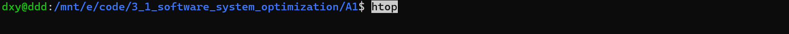

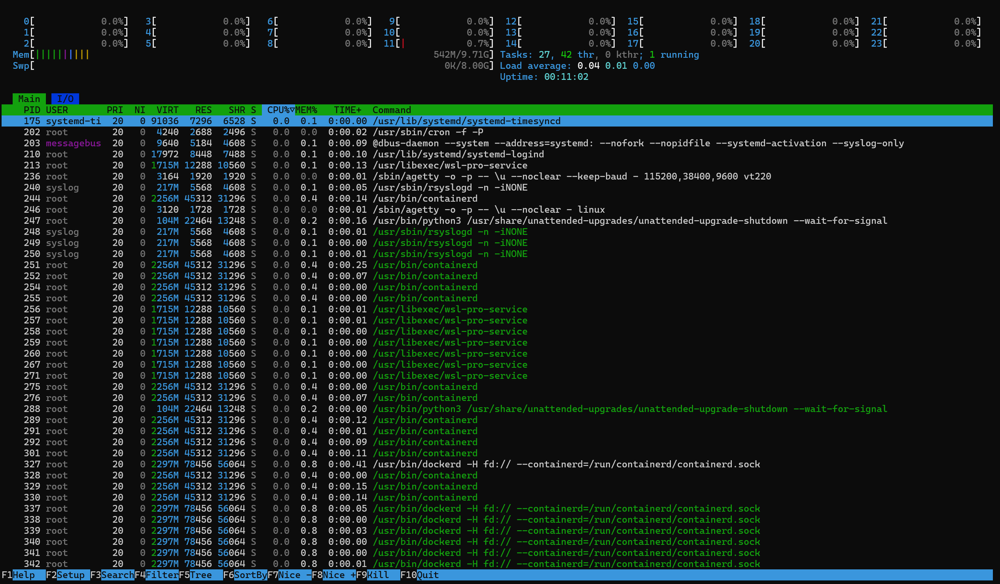

### (10)–(13) 性能统计命令

（10）`vmstat 1`

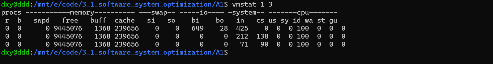

（11）`mpstat -P ALL 1`

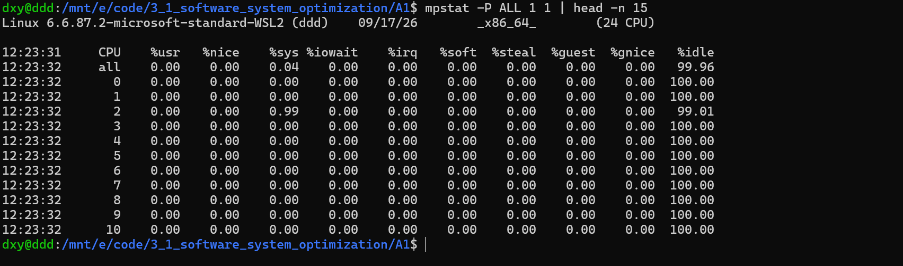

（12）`pidstat 1`

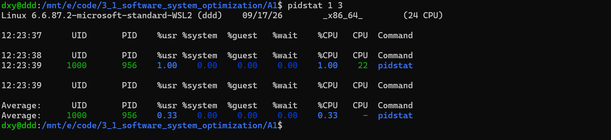

（13）`iostat -xz 1`

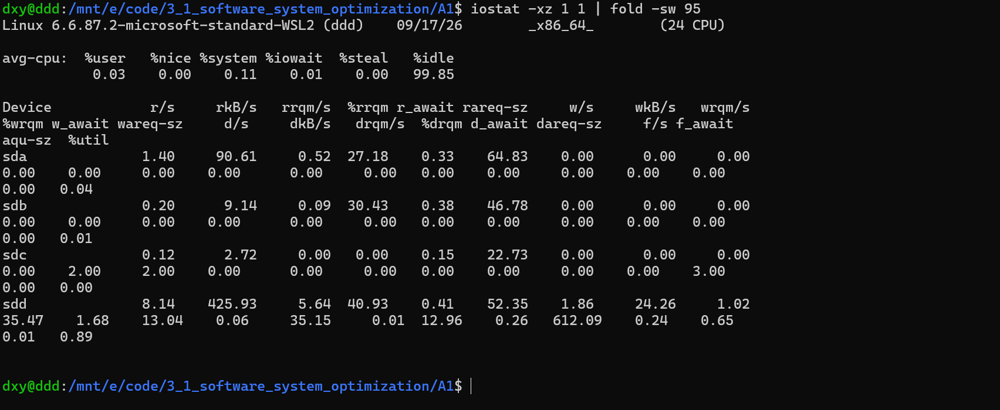

**a.** 四条命令中的 `1` 均表示每隔 1 秒采样一次。`vmstat` 和 `iostat` 的首批数据是自系统启动以来的平均值，后续数据反映相邻采样间隔。

**b.** `vmstat` 统计可运行/阻塞进程、内存、交换、块 I/O、系统中断与上下文切换，以及 CPU 时间分布。`mpstat` 统计整体及每个逻辑 CPU 的用户态、系统态、I/O 等待和空闲等比例；本机样本显示 24 个逻辑 CPU。`pidstat` 统计进程或任务在采样间隔内的 CPU 使用，包括 `%usr`、`%system` 和运行所在 CPU 等字段。`iostat` 统计 CPU 总览和块设备的吞吐、请求率、等待时间、队列和设备利用率；本机可见 `sda`–`sdd` 等 WSL2 设备。

**c.** `ps -aux` 的 `%CPU` 是快照中按进程累计 CPU 时间和存活时长计算的占比；`pidstat` 的 `%CPU` 反映采样间隔内某进程的 CPU 使用；`top/htop` 按刷新周期更新进程 CPU 使用率，界面还提供整机或各核负载。因此同一进程在不同时间、统计窗口和多核显示模式下数值可能不同；`top` 顶部的整机 `%Cpu(s)` 与单个进程的 `%CPU` 观察对象不同。

### (14) `sar -n DEV 1`

**a.** `1` 表示每隔 1 秒输出一轮网络设备统计。

**b.** `-n DEV` 按网络接口给出收发包速率 `rxpck/s`、`txpck/s`，收发数据速率 `rxkB/s`、`txkB/s`，压缩包速率 `rxcmp/s`、`txcmp/s`，接收组播包速率 `rxmcst/s` 和接口利用率 `%ifutil`。本次可见 `lo`、`eth0`、`docker0`；所截图的采样轮次这些指标均为 0，表示该短时间窗口内没有记录到对应流量。

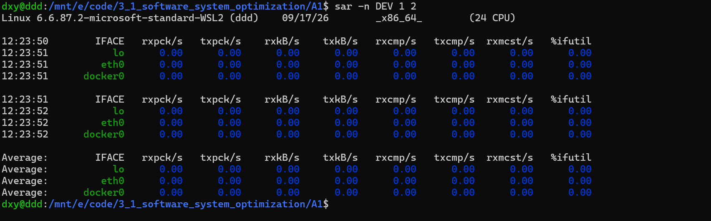

### (15) `uptime`

**①** 截图样本为 `12:23:58 up 11 min, 1 user, load average: 0.16, 0.05, 0.01`，依次是当前时间、运行时长、登录用户数和三个平均负载值。

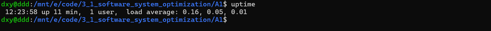

**②** 三个负载值依次对应最近 1、5、15 分钟，反映可运行及不可中断等待任务的平均数量。负载以任务数计量；本机有 24 个逻辑 CPU。

### (16) `/proc/interrupts` 与 `/proc/softirqs`

**a.** `/proc/interrupts` 按 CPU 列出各 IRQ/中断类别的累计计数及设备信息；`/proc/softirqs` 按 CPU 列出 TIMER、NET_RX、SCHED、RCU 等软中断类别的累计计数。

**b.** [完整统计快照](evidence/interrupts-totals.txt)中，设备 IRQ 以 `25: virtio0-virtqueues` 最多，合计 4223 次；其他中断类别中，`CAL` 为 269027 次，`HVS` 为 216119 次。软中断以 `RCU` 最多，合计 122262 次，其次是 `SCHED` 的 99640 次和 `TASKLET` 的 95092 次。`CAL` 对应核间函数调用，`HVS` 对应 Hyper-V 计时器，`RCU` 与内核读侧同步维护有关。

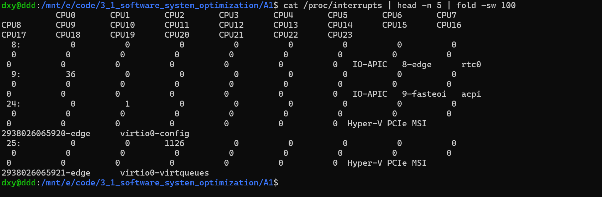

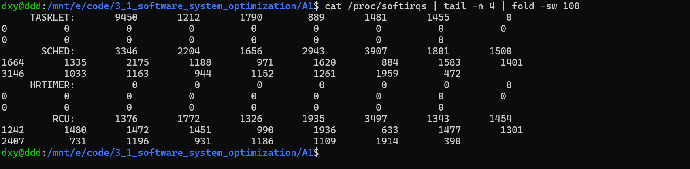

### (17) `lstopo --of svg > topo.svg`

在 [topo.svg](topo.svg) 中，WSL2 显示一个 Machine、一个 Package、一个 NUMA Node；该 Package 下有共享的 32 MB L3、12 个 Core，每 Core 两个 PU，总计 24 个 PU。各 Core 对应 1024 KB L2、32 KB L1d、32 KB L1i；图上还列出 `eth0` 和若干虚拟块设备。

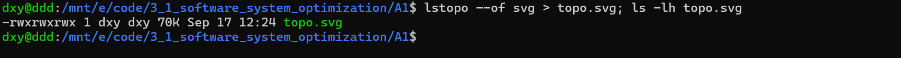

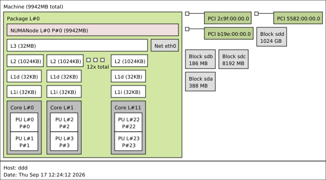

### (18) Git 命令练习

**① 用户名和邮箱。** 执行 `git config user.name "丁熙妍"`、`git config user.email "10234500007@stu.ecnu.edu.cn"`，再用 `git config --get` 查看设置结果。

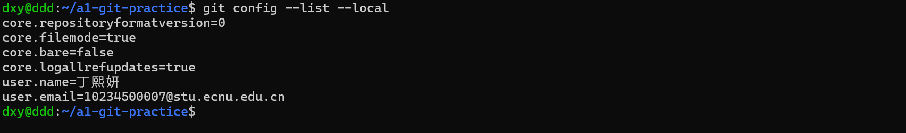

**② 初始化和分支。** 执行 `git init` 后，`git branch --show-current` 输出 `master`。设置新仓库的默认分支名称可用 `git config --global init.defaultBranch main`；重命名当前分支可用 `git branch -m main`。

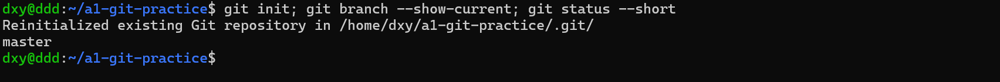

**③ 提交。** 创建但未暂存 `README.md` 时执行 `git commit -m "docs: add practice readme"`，Git 提示有未跟踪文件、没有可提交的改动。执行 `git add README.md` 后再提交，得到首次 commit。

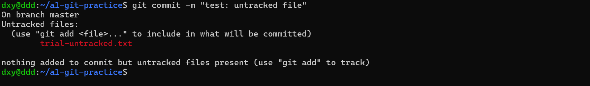

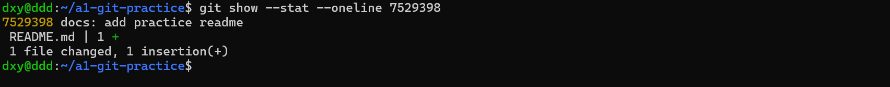

**④ 图片忽略与取消跟踪。** 将 `practice.png` 加入仓库并提交：`git add practice.png`、`git commit -m "chore: add practice image"`。随后把文件名写入 `.gitignore`，执行 `git rm --cached practice.png`、`git add .gitignore` 和 `git commit -m "chore: ignore practice image"`。`git ls-files` 中已无该图片，`git check-ignore -v practice.png` 显示忽略规则，本地图片仍在。`git rm --cached` 从 Git 索引移除图片，保留工作区文件。

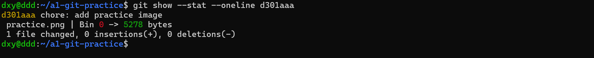

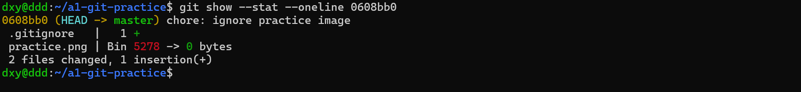

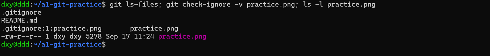

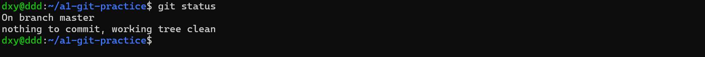

**⑤ 语义化提交。** 阅读 [Conventional Commits 1.0.0](https://www.conventionalcommits.org/en/v1.0.0/#summary) 后，我的理解是：提交标题以 `type: description`（可选 scope）说明变更性质，例如 `docs: add practice readme` 表示文档变更，`fix: correct matrix size` 表示修复，`feat:` 表示新功能；破坏兼容性的变更需要显式标记。这样历史更容易阅读，也便于自动生成变更记录。练习仓库中的三条提交实际使用了 `docs:`、`chore:`。

**⑥ 合并方式。** `git merge` 把目标分支的历史并入当前分支，存在分叉时通常生成 merge commit，保留原提交关系；`git rebase` 把当前分支的提交依次重新应用到新基点，形成线性历史，提交 SHA 随之变化。重写共享分支后，其他人基于旧提交的分支需要重新对齐。

## 3. MIT 6.172 Homework 1: Getting Started

### Write-up 2

原始 `pointer.c` 执行 `make pointer` 时，编译器对修改只读目标及重新赋值 const 指针的语句报错。逐项回答源码注释：

1. `argv` 在 `main` 的参数中等效为 `char **`，指向各命令行参数字符串指针。
2. `char d = *pc` 取得字符串 `"6.172"` 的首字符，输出 `char d = 6`。
3. `pcp = argv` 合法，因为两者都是 `char **`。
4. `pcc2` 的类型是 `char const *`，与 `const char *` 等价：指向不可经该指针修改的字符，指针自身可重新赋值。
5. `*pcc = '7'` 非法，因为 `pcc` 指向 const char。
6. `pcc = *pcp` 合法：右侧为 `char *`，可赋给指向 const char 的可变指针。
7. `pcc = argv[0]` 同理合法。
8. `cp = *pcp` 非法，因为 `cp` 是 `char * const`，指针自身不可重新赋值。
9. `cp = *argv` 同理非法。
10. `*cp = '!'` 合法，因为 `cp` 指向的字符不是 const。
11. `cpc = *pcp` 非法，因为 `cpc` 是 `const char * const`，指针自身不可重新赋值。
12. `cpc = argv[0]` 同理非法。
13. `*cpc = '@'` 非法，因为 `cpc` 指向 const char。

注释六条非法赋值后，`make pointer` 编译成功。

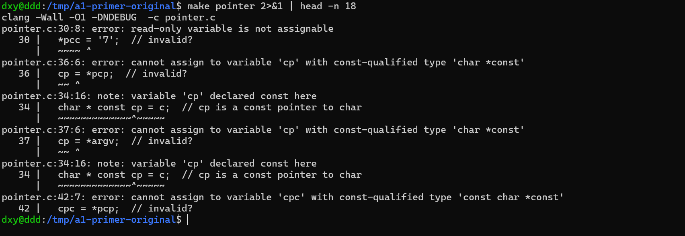

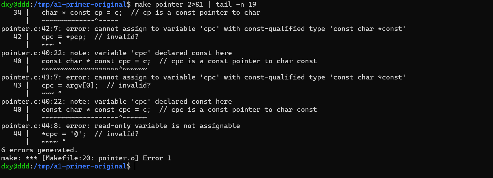

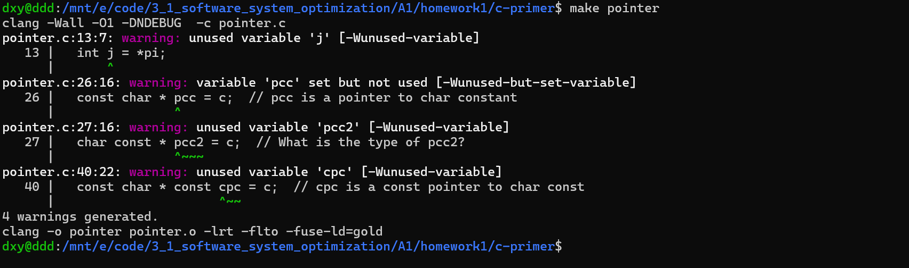

### Write-up 3

`sizes.c` 输出题目所列类型及其指针的 `sizeof`。本机 `int` 为 4 字节、`__int128` 为 16 字节。数组 `x` 用 `sizeof(x)` 测得整体 20 字节，用 `sizeof(&x)` 测得指向整个数组的指针 8 字节；`student` 对象及其指针均为 8 字节。

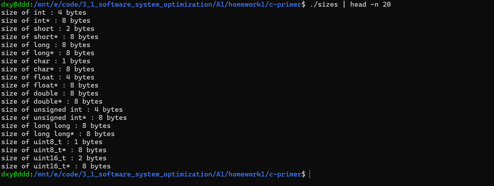

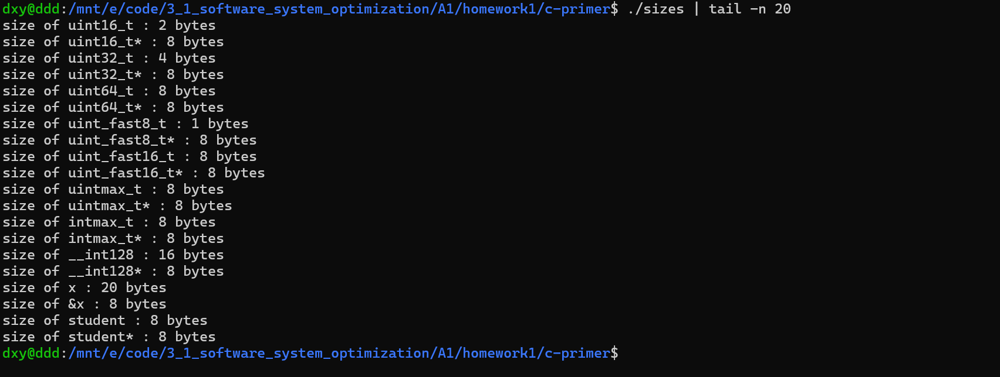

### Write-up 4

原 `swap(int i, int j)` 只交换函数内的值拷贝，不能改变 `main` 的 `k`、`m`。将参数改为指针，并在 `main` 中传入变量地址。

```c
// Copyright (c) 2012 MIT License by 6.172 Staff

#include <stdio.h>
#include <stdlib.h>
#include <stdint.h>

void swap(int *i, int *j) {
  int temp = *i;
  *i = *j;
  *j = temp;
}

int main() {
  int k = 1;
  int m = 2;
  swap(&k, &m);
  // What does this print?
  printf("k = %d, m = %d\n", k, m);

  return 0;
}
```

`./swap` 输出 `k = 2, m = 1`。

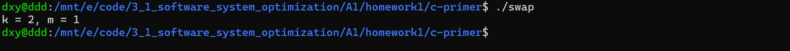

`verifier.py` 对 `sizes.c` 和 `swap.c` 的检查结果为 `LGTM`。

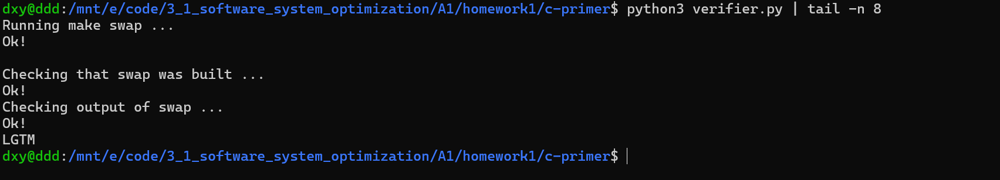

### Write-up 5

将 `matrix-multiply/Makefile` 的普通构建优化级别由 `-O1` 改为 `-O3`。执行 `make clean; make` 时，旧目标文件和二进制文件被清理，随后 `clang -O3 -DNDEBUG ...` 编译 `testbed.c`、`matrix_multiply.c` 并链接生成 `matrix_multiply`。

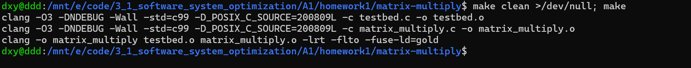

### Write-up 6

执行 `make clean; make ASAN=1; ./matrix_multiply` 后，LeakSanitizer 报告 `make_matrix` 中的内存泄漏：直接泄漏 48 字节，间接泄漏 288 字节，合计 336 字节、18 次分配。

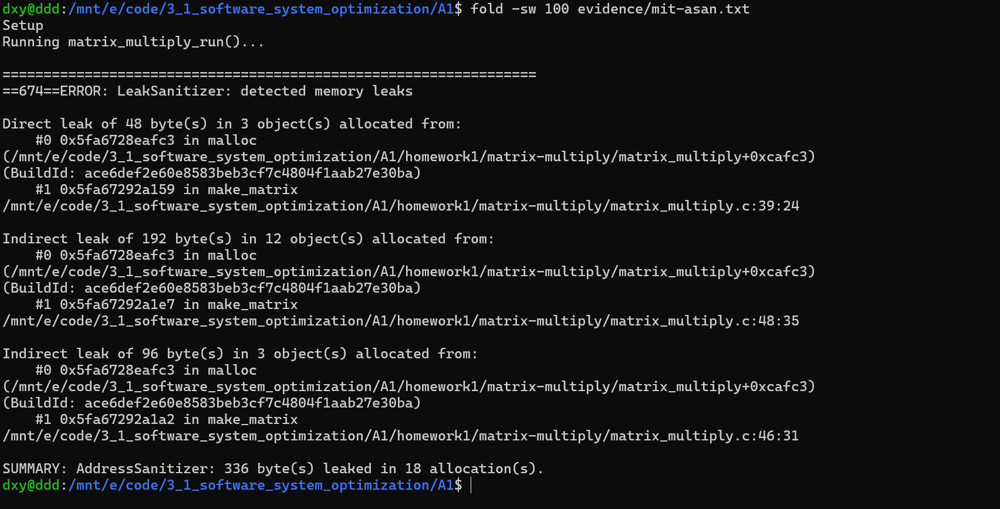

### Write-up 7

修复后执行 `./matrix_multiply -p`，两个 4×4 矩阵的乘积与逐项计算结果一致。

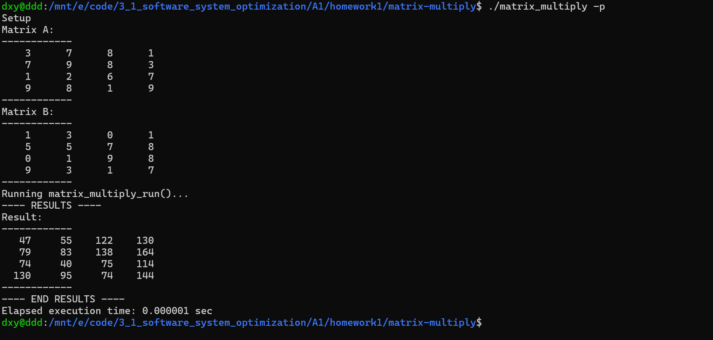

### Write-up 8

在输出结果后，调用现有的 `free_matrix()` 释放 A、B、C。最终执行 `valgrind --leak-check=full ./matrix_multiply -p`，报告显示 `in use at exit: 0 bytes in 0 blocks`、`All heap blocks were freed`、`ERROR SUMMARY: 0 errors`。

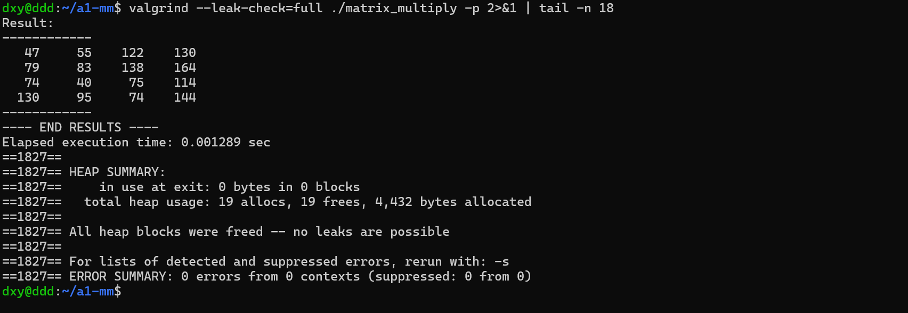
